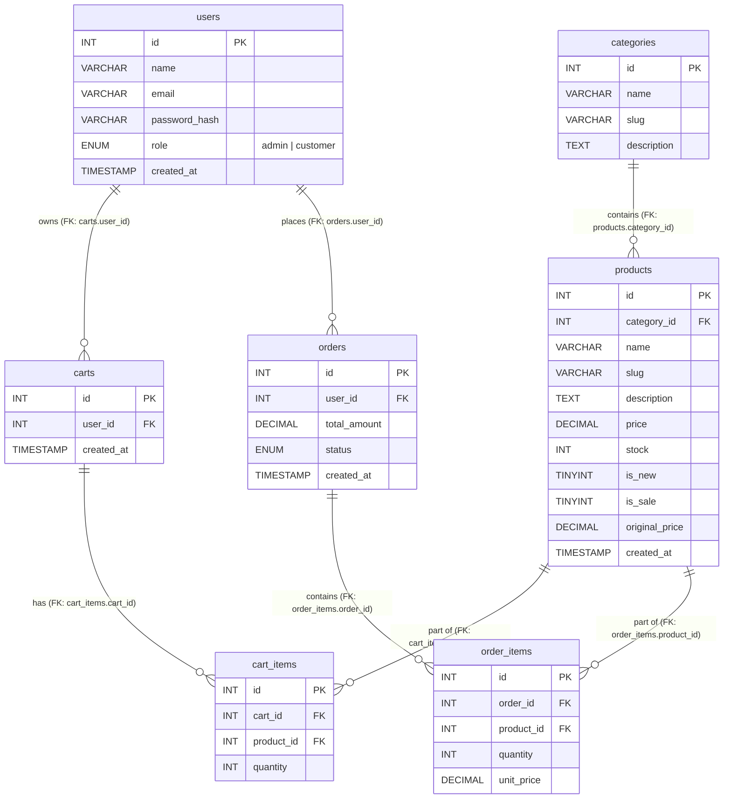
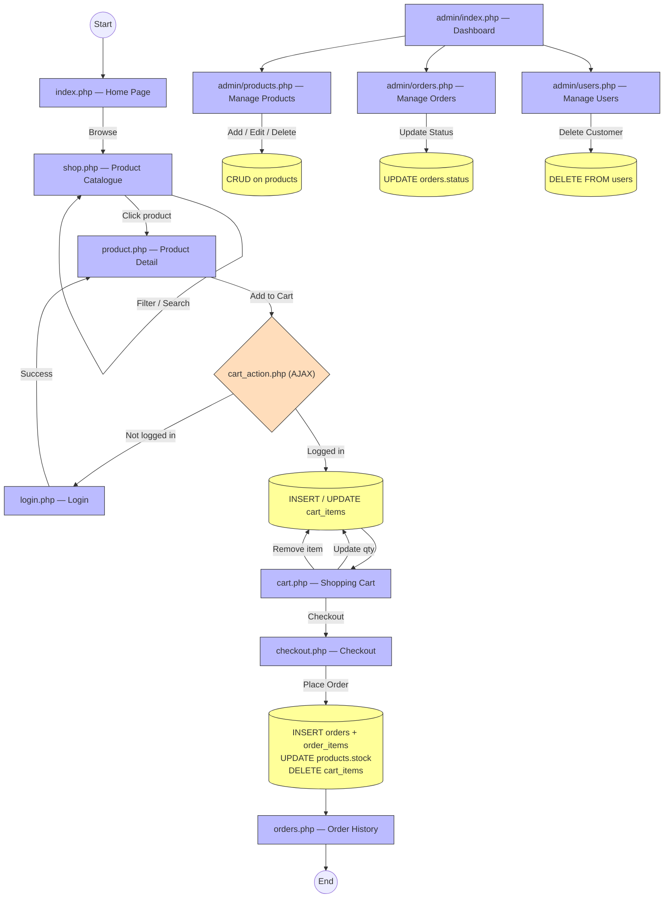

# Web Application Development — Final Exam Project Report

## E-Commerce Shop (PHP + MySQL)

**Group Members:**
| # | Name | Role |
|---|------|------|
| 1 | [Member 1 Name] | Database Schema · Authentication · Cart Logic |
| 2 | [Member 2 Name] | Product Listing · Pagination · Category Filters |
| 3 | [Member 3 Name] | Admin Dashboard · Order Management · Reports |

> *(Update names above with your actual group members)*

---

## 1. Application Overview

This project is a full-featured **Mini E-Commerce Web Application** built with PHP and MySQL. It allows customers to browse products by category, manage a shopping cart, and place orders. An admin panel provides complete inventory and order management.

**Key Features:**
- Customer registration, login, and profile management
- Product browsing with category filter, search, and pagination
- Shopping cart with live item quantity updates (AJAX)
- Checkout flow with automatic total calculation and stock deduction
- Admin dashboard with CRUD for products, orders, and users
- Role-based access control (admin vs. customer)

---

## 2. Database Schema — Table Information

The database consists of **7 tables** with **5 tables** connected via foreign keys (satisfying the minimum 3 connected tables requirement).

### Table: `users`
| Column | Type | Constraints |
|--------|------|-------------|
| `id` | INT | PRIMARY KEY, AUTO_INCREMENT |
| `name` | VARCHAR(255) | NOT NULL |
| `email` | VARCHAR(255) | NOT NULL, UNIQUE |
| `password_hash` | VARCHAR(255) | NOT NULL |
| `role` | ENUM('admin','customer') | DEFAULT 'customer' |
| `created_at` | TIMESTAMP | DEFAULT CURRENT_TIMESTAMP |

### Table: `categories`
| Column | Type | Constraints |
|--------|------|-------------|
| `id` | INT | PRIMARY KEY, AUTO_INCREMENT |
| `name` | VARCHAR(100) | NOT NULL |
| `slug` | VARCHAR(100) | NOT NULL, UNIQUE |
| `description` | TEXT | — |

### Table: `products` ← Foreign Key to `categories`
| Column | Type | Constraints |
|--------|------|-------------|
| `id` | INT | PRIMARY KEY, AUTO_INCREMENT |
| `category_id` | INT | **FK → categories(id)** ON DELETE CASCADE |
| `name` | VARCHAR(255) | NOT NULL |
| `slug` | VARCHAR(255) | NOT NULL, UNIQUE |
| `description` | TEXT | — |
| `price` | DECIMAL(10,2) | NOT NULL |
| `stock` | INT | NOT NULL, DEFAULT 0 |
| `image_url` | VARCHAR(255) | — |
| `is_new` | TINYINT(1) | DEFAULT 0 |
| `is_sale` | TINYINT(1) | DEFAULT 0 |
| `original_price` | DECIMAL(10,2) | NULL (sale only) |
| `created_at` | TIMESTAMP | DEFAULT CURRENT_TIMESTAMP |

### Table: `carts` ← Foreign Key to `users`
| Column | Type | Constraints |
|--------|------|-------------|
| `id` | INT | PRIMARY KEY, AUTO_INCREMENT |
| `user_id` | INT | **FK → users(id)** ON DELETE CASCADE |
| `created_at` | TIMESTAMP | DEFAULT CURRENT_TIMESTAMP |

### Table: `cart_items` ← Foreign Keys to `carts` + `products`
| Column | Type | Constraints |
|--------|------|-------------|
| `id` | INT | PRIMARY KEY, AUTO_INCREMENT |
| `cart_id` | INT | **FK → carts(id)** ON DELETE CASCADE |
| `product_id` | INT | **FK → products(id)** ON DELETE CASCADE |
| `quantity` | INT | NOT NULL, DEFAULT 1 |

### Table: `orders` ← Foreign Key to `users`
| Column | Type | Constraints |
|--------|------|-------------|
| `id` | INT | PRIMARY KEY, AUTO_INCREMENT |
| `user_id` | INT | **FK → users(id)** ON DELETE CASCADE |
| `total_amount` | DECIMAL(10,2) | NOT NULL |
| `status` | ENUM('pending','paid','shipped','completed','cancelled') | DEFAULT 'pending' |
| `created_at` | TIMESTAMP | DEFAULT CURRENT_TIMESTAMP |

### Table: `order_items` ← Foreign Keys to `orders` + `products`
| Column | Type | Constraints |
|--------|------|-------------|
| `id` | INT | PRIMARY KEY, AUTO_INCREMENT |
| `order_id` | INT | **FK → orders(id)** ON DELETE CASCADE |
| `product_id` | INT | **FK → products(id)** ON DELETE CASCADE |
| `quantity` | INT | NOT NULL |
| `unit_price` | DECIMAL(10,2) | NOT NULL |

---

## 3. Entity Relationship Diagram (ERD)



> **Requirement met:** 5 out of 7 tables have at least one foreign key, forming a connected schema with 8 total FK relationships.

---

## 4. Application Flow



---

## 5. CRUD Operations — Complete Matrix

> All inline code comments are marked with `// ✅ CREATE:`, `// ✅ READ:`, `// ✅ UPDATE:`, `// ✅ DELETE:` in the source files.

### ✅ Requirement: CREATE

| File | Table(s) | SQL Statement |
|------|----------|---------------|
| `register.php` | `users` | `INSERT INTO users (name, email, password_hash, role) VALUES (?)` |
| `register.php` | `carts` | `INSERT INTO carts (user_id) VALUES (?)` |
| `cart_action.php` | `carts` | `INSERT INTO carts (user_id) VALUES (?)` *(auto-create)* |
| `cart_action.php` | `cart_items` | `INSERT INTO cart_items (cart_id, product_id, quantity) VALUES (?, ?, ?)` |
| `checkout.php` | `orders` | `INSERT INTO orders (user_id, total_amount, status) VALUES (?, ?, 'paid')` |
| `checkout.php` | `order_items` | `INSERT INTO order_items (order_id, product_id, quantity, unit_price) VALUES (?, ?, ?, ?)` |
| `admin/products.php` | `products` | `INSERT INTO products (category_id, name, slug, ...) VALUES (?)` |

### ✅ Requirement: READ

| File | Table(s) | SQL Statement |
|------|----------|---------------|
| `index.php` | `categories` | `SELECT * FROM categories LIMIT 6` |
| `index.php` | `products` ⋈ `categories` | `SELECT p.*, c.name FROM products p JOIN categories c ON p.category_id = c.id ...` |
| `shop.php` | `products` ⋈ `categories` | `SELECT p.*, c.name FROM products p JOIN categories c WHERE ... LIMIT ? OFFSET ?` |
| `product.php` | `products` ⋈ `categories` | `SELECT p.*, c.name FROM products p JOIN categories c WHERE p.slug = ?` |
| `cart.php` | `cart_items` ⋈ `products` | `SELECT ci.*, p.name, p.price FROM cart_items ci JOIN products p ON ci.product_id = p.id` |
| `orders.php` | `orders` ⋈ `order_items` ⋈ `products` | `SELECT o.*, oi.*, p.name FROM orders o JOIN order_items oi JOIN products p WHERE o.user_id = ?` |
| `admin/products.php` | `products` ⋈ `categories` | `SELECT p.*, c.name FROM products p JOIN categories c WHERE ... LIMIT ? OFFSET ?` |
| `admin/orders.php` | `orders` ⋈ `users` | `SELECT o.*, u.name, u.email FROM orders o JOIN users u ON o.user_id = u.id` |
| `admin/users.php` | `users` | `SELECT id, name, email, role, created_at FROM users ORDER BY created_at DESC` |

### ✅ Requirement: UPDATE

| File | Table(s) | SQL Statement |
|------|----------|---------------|
| `cart_action.php` | `cart_items` | `UPDATE cart_items SET quantity = ? WHERE id = ?` |
| `checkout.php` | `products` (stock) | `UPDATE products SET stock = stock - ? WHERE id = ?` *(business logic)* |
| `admin/products.php` | `products` (quick edit) | `UPDATE products SET price=?, stock=?, is_new=?, is_sale=?, original_price=? WHERE id=?` |
| `admin/edit_product.php` | `products` (full edit) | `UPDATE products SET name=?, slug=?, category_id=?, description=?, price=?, ... WHERE id=?` |
| `admin/orders.php` | `orders` | `UPDATE orders SET status = ? WHERE id = ?` |
| `profile.php` | `users` | `UPDATE users SET name = ?, email = ? WHERE id = ?` |

### ✅ Requirement: DELETE

| File | Table(s) | SQL Statement |
|------|----------|---------------|
| `cart_action.php` | `cart_items` | `DELETE FROM cart_items WHERE cart_id = ? AND product_id = ?` |
| `checkout.php` | `cart_items` | `DELETE FROM cart_items WHERE cart_id = ?` *(clears cart post-purchase)* |
| `admin/products.php` | `products` | `DELETE FROM products WHERE id = ?` |
| `admin/users.php` | `users` | `DELETE FROM users WHERE id = ? AND role != 'admin'` |

---

## 6. Business Logic

| Logic | File | Description |
|-------|------|-------------|
| **Auto-total calculation** | `checkout.php` | Subtotal summed from cart items; shipping = $10 if subtotal < $50, else Free |
| **Stock deduction on purchase** | `checkout.php` | `UPDATE products SET stock = stock - quantity` for each ordered item, inside a DB transaction |
| **Cart auto-provisioning** | `register.php`, `cart_action.php` | A `carts` row is automatically created for every new user |
| **Stock validation** | `cart_action.php` | Cannot add more items than available stock |
| **CSRF protection** | All POST forms | Every state-changing form uses a CSRF token to prevent cross-site request forgery |
| **Role-based access** | `includes/auth.php` | Admin pages call `requireAdmin()`; customer pages call `requireLogin()` |

---

## 7. File Structure Summary

```
wadfinalexam/
├── index.php               ← Home page (READ: products + categories)
├── shop.php                ← Product catalogue (READ with filter/search/paginate)
├── product.php             ← Single product detail (READ)
├── cart.php                ← Shopping cart view (READ)
├── cart_action.php         ← AJAX cart handler (CREATE / UPDATE / DELETE cart_items)
├── checkout.php            ← Checkout & order placement (CREATE order, UPDATE stock, DELETE cart)
├── orders.php              ← Customer order history (READ)
├── register.php            ← User registration (CREATE user + cart)
├── login.php               ← User authentication (READ)
├── logout.php              ← Session destroy
├── profile.php             ← Profile edit (UPDATE user)
├── sale.php                ← Sale products page (READ)
├── new-arrivals.php        ← New products page (READ)
├── admin/
│   ├── index.php           ← Admin dashboard (READ stats)
│   ├── products.php        ← Manage products (CREATE / READ / UPDATE / DELETE)
│   ├── edit_product.php    ← Full product editor (UPDATE)
│   ├── orders.php          ← Manage orders (READ / UPDATE status)
│   └── users.php           ← Manage users (READ / DELETE)
├── config/
│   └── db.php              ← PDO database connection
├── includes/
│   ├── functions.php       ← Helper functions (formatPrice, sanitize, CSRF, flash)
│   ├── auth.php            ← Authentication helpers
│   ├── header.php          ← Shared navigation header
│   └── footer.php          ← Shared footer
└── seed.sql                ← Database schema + sample data
```

---

## 8. How to Run the Application

1. **Prerequisites:** XAMPP (Apache + MySQL + PHP 8.1+)
2. Start **Apache** and **MySQL** in XAMPP Control Panel
3. Open **phpMyAdmin** → create a new database named `wadfinalexam`
4. Import `seed.sql` into the database
5. Navigate to `http://localhost/wadfinalexam/` in your browser

**Test Credentials:**
| Role | Email | Password |
|------|-------|----------|
| Admin | `admin@shop.com` | `admin123` |
| Customer | `customer@shop.com` | `test123` |

---

*Report generated for Web Application Development Final Exam — April 2026*
