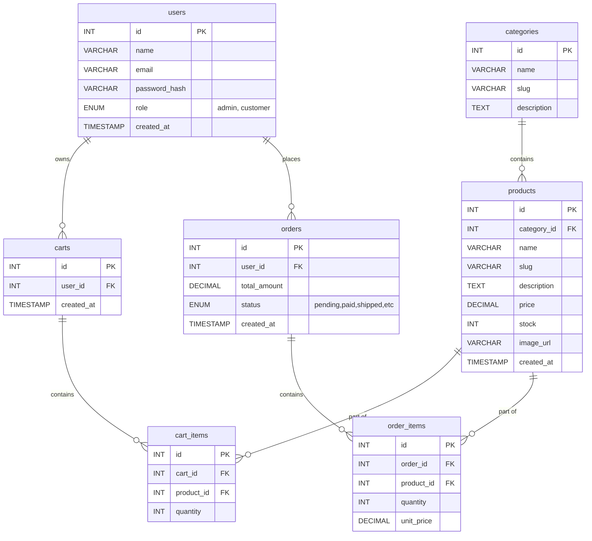
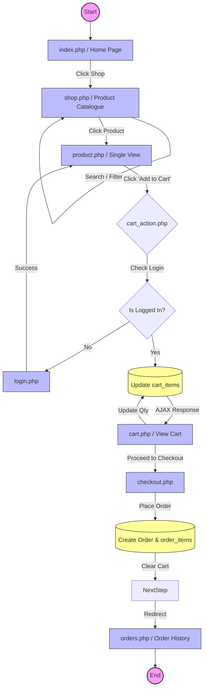

# Web Application Development: Final E-Commerce Project Report

**Group Members:**
- [Group Member 1 Name] - Implemented: Database Schema, Authentication, Cart Logic
- [Group Member 2 Name] - Implemented: Product Listing, Pagination, Filters
- [Group Member 3 Name] - Implemented: Admin Dashboard, Order Management
*(Please update with your actual group members and roles)*

---

## 1. Entity Relationship Diagram (ERD)

---

## 2. Application Flow Diagram: Customer Purchase Journey

---

## 3. CRUD Operations Matrix

| Table | Operation | Responsible File | SQL Command Summary |
|-------|-----------|-----------------|---------------------|
| **`users`** | **C**reate | `register.php` | `INSERT INTO users (name, email, password_hash, role) VALUES (...)` |
| | **R**ead | `admin/users.php` `login.php` | `SELECT id, name, email, role... FROM users...` `SELECT * FROM users WHERE email = ?` |
| | **U**pdate | `profile.php` | `UPDATE users SET name = ?, email = ?... WHERE id = ?` |
| | **D**elete | `admin/users.php` | `DELETE FROM users WHERE id = ? AND role != 'admin'` |
| **`products`** | **C**reate | `admin/edit_product.php` | `INSERT INTO products (name, slug, category_id...) VALUES (...)` |
| | **R**ead | `shop.php` `admin/products.php` | `SELECT p.*, c.name FROM products p JOIN categories... WHERE ... LIMIT...OFFSET...` |
| | **U**pdate | `admin/edit_product.php` | `UPDATE products SET name=?, slug=? ... WHERE id=?` |
| | **D**elete | `admin/products.php` | `DELETE FROM products WHERE id = ?` |
| **`categories`**| **C**reate | *Seed SQL* | N/A (Handled via DB creation) |
| | **R**ead | `shop.php` `index.php` | `SELECT * FROM categories ORDER BY name ASC` |
| | **U**pdate | *N/A* | N/A |
| | **D**elete | *N/A* | N/A |
| **`carts`** & **`cart_items`** | **C**reate | `register.php` `cart_action.php` | `INSERT INTO carts (user_id)` `INSERT INTO cart_items (cart_id, product_id, quantity)` |
| | **R**ead | `cart.php` | `SELECT ci.*, p.name, p.price... FROM cart_items ci JOIN...` |
| | **U**pdate | `cart_action.php` | `UPDATE cart_items SET quantity = ? WHERE id = ?` |
| | **D**elete | `cart_action.php` `checkout.php` | `DELETE FROM cart_items WHERE cart_id = ? AND product_id = ?` |
| **`orders`** & **`order_items`**| **C**reate | `checkout.php` | `INSERT INTO orders ...` `INSERT INTO order_items ...` |
| | **R**ead | `orders.php` `admin/orders.php` | `SELECT * FROM orders WHERE user_id = ?` `SELECT oi.*, p.name FROM order_items...` |
| | **U**pdate | `admin/orders.php` `orders.php` | `UPDATE orders SET status = ? WHERE id = ?` |
| | **D**elete | *N/A* | (Soft "cancelled" status is used instead of hard deletion) |

---

## 4. Screenshots
> [!NOTE]
> Please launch your local development server (`php -S localhost:8000` from the project root) and insert your screenshots here.

- `index.php` (Home Hero & Featured)
- `shop.php` (With Filters and Pagination applied)
- `cart.php` (Showing item calculations)
- `checkout.php` (Form and Summary)
- `admin/index.php` (Dashboard Metrics)
